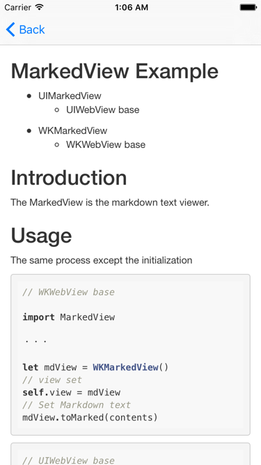

## MarkedView Example
---

* UIMarkedView
    * UIWebView base


* WKMarkedView
    * WKWebView base




## Introduction
---

The MarkedView is the markdown text viewer.


## Usage
---

The same process except the initialization

```
// WKWebView base

import MarkedView

・・・

let mdView = WKMarkedView()
// view set
self.view = mdView
// Set Markdown text
mdView.toMarked(contents)
```

```
// UIWebView base

import MarkedView

・・・

let mdView = UIMarkedView()
// view set
self.view = mdView
// Set Markdown text
mdView.toMarked(contents)
```

## Installation
---

MarkedView is available through [CocoaPods](https://cocoapods.org/).

To install it, simply add the following line to your ``` Podfile ```:


```
pod 'MarkedView'
```

Then run the following command:

```
$ pod install
```

## License
---

MarkedView is available under the MIT license. See the LICENSE file for more info.
